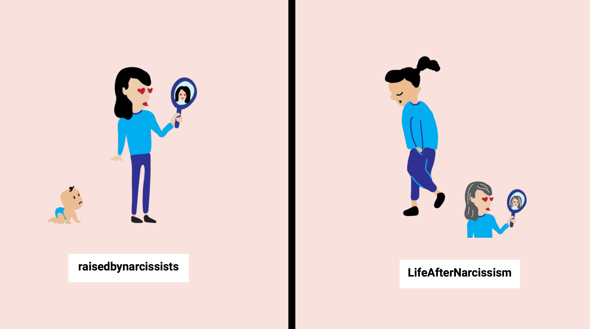
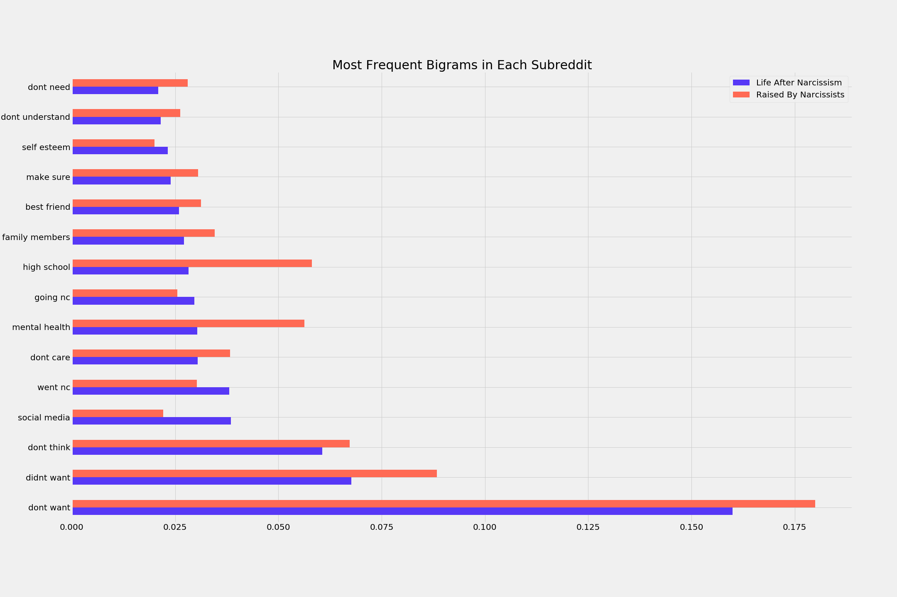
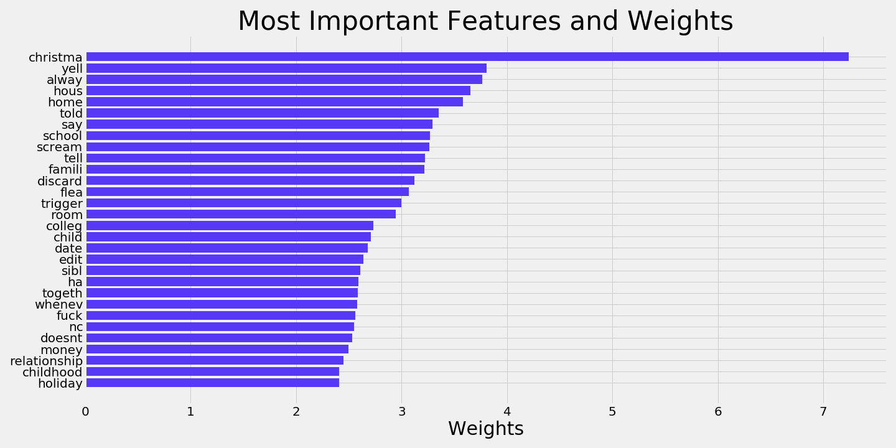
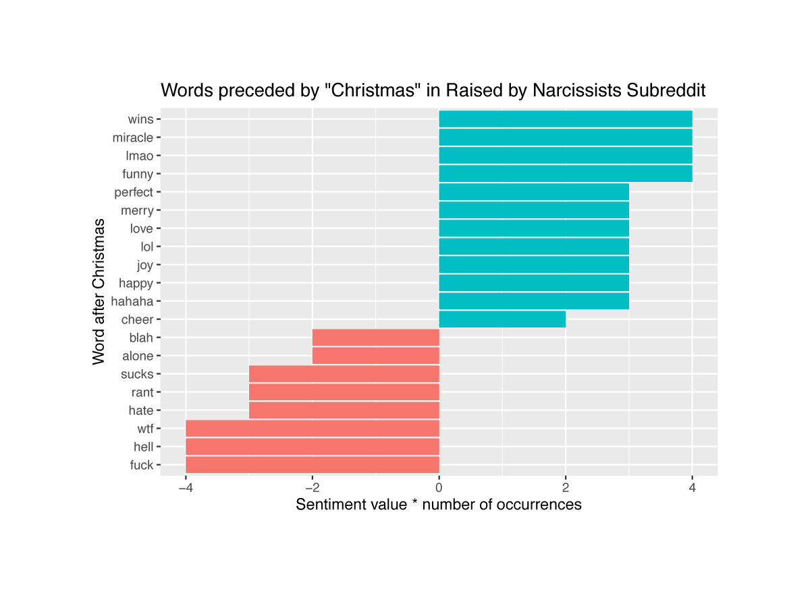
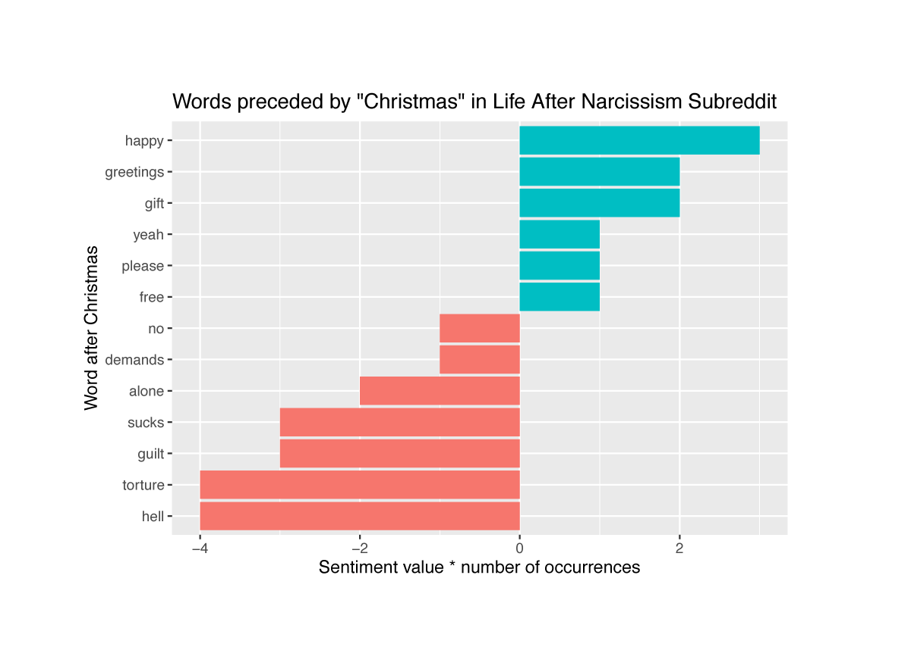
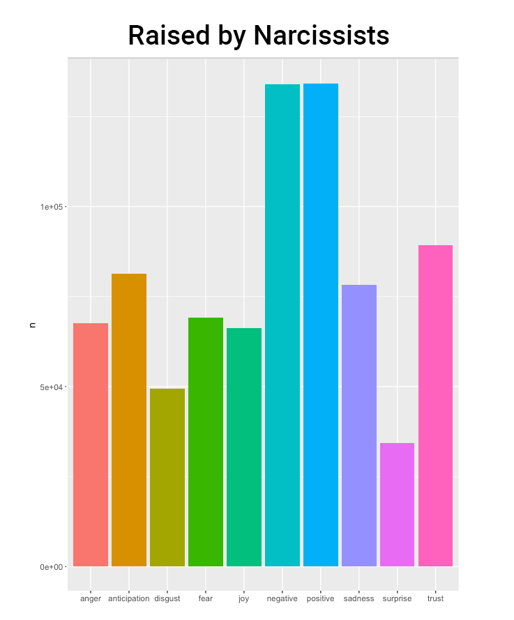

# Project 3: Reddit Thread Classification

### Executive Summary

In this project, I explored two Reddit threads, [r/raisedbynarcissists](https://www.reddit.com/r/raisedbynarcissists/) and [r/LifeAfterNarcissism](https://www.reddit.com/r/LifeAfterNarcissism/).

__Raised by Narcissists__, with a community of 523k members, is a support group for individuals who grew up with narcissistic family members. Individuals share their stories, ask questions, and support each other.

__Life After Narcissism__, with a community of 36K members, is an extension of Raised by Narcissists for folks who are learning how to move on from narcissistic relationships.

Using natural language processing techniques, I built a logistic regression and random forest model to predict the subreddit classification on each post text.

---

### Problem Statement
With the onset of natural language processing (NLP) tools, we are now living in a world in which we regularly interact and rely on computer-generated information. NLP also presents a lot of opportunities for the health sector. In public health, a lot of the work is done on assessing someone's needs. If we can automate some of the assessment process, that can enhance our ability to provide services that best match the needs.

I see lots of tech companies wanting to move into the health sector, and I feel as public health practitioners, we have to learn how to engage with these new techniques to guide the implementation.

In the context of this project, the first step to understanding the mental health implications of a narcissistic relationship is to identify if you've been in one. Building a good classification model based on a user's text, could help someone assess whether or not they're in an abusive relationship.

How might we help someone identify when they're in a narcissistic relationship?

---

### Data

#### Push Shift API
Using [Push Shift API](https://pushshift.io), I pulled 10,000 threads from each Reddit post. The code for the API query is [here](./code/01_reddit_api.ipynb). The cleaned dataset (total of 20,000 rows) is [here](./assets/reddit.pkl).

#### Description of Data

|Predictive Variable|Data type|Description|
|:---|:---|:---|
|title_selftext|object|Combined the 'title' and 'selftext' of each post|
|word_count|int|Number of words per post|
|sentiment|float|An average score (between -1 and 1) of positive to negative words per post|

### Data Cleaning

The data cleaning work was completed in Python [here](./code/02_clean.ipynb). I used regular expressions to remove special characters, numeric characters, html, and url's.

### Exploring the Data

The data exploratory work was done mostly in python [here](./code/02_eda.ipynb).

I first wanted to explore the common words or bigrams in each subreddit. This was an iterative process:

1. Look at the most common words in my dataset
2. Determine which ones should be considered as stop words
3. Add to my custom list of stop words
4. Repeat until I get common words that have actual meaning

The most common bigrams in each subreddit can be seen here:

"nc" in this context stands for "no contact." We can see that the Life After Narcissism thread contains more posts with "nc," which could mean that people have chosen to not stay in contact with the narcissistic person in their lives.

---

### Models

I first stemmed my words using PorterStemmer, and then used TfidfVectorizer for my word matrix.

|Model|Train Score|Test Score|
|:---|:---|:---|
|Base|0.50|0.50|
|Ridge|0.90|0.75|
|Random Forest|0.74|0.71|

__Ridge Regression:__
This model included both text data and my numeric features, word count and sentiment score. I ran my numeric features through standard scalar and then created a pipeline for my logistic regression. With a test accuracy score of 0.75, this model accurately predicts the reddit class 75% of the time. This model is overfit to my training data, since the accuracy score is higher in my training set than my test set.

The biggest predictor in this model is the word "Christmas." Holding all else constant, the appearance of the word "Christmas" increases the log odds of the post being in raisedbynarcissists by 7.23.

I was curious to see what words followed "Christmas," so I did some exploratory analysis in R [here](./code/02_eda_emotional_analysis_R/emotional_analysis.R).

For each subreddit, I looked at the most common words that followed "Christmas," and rated its sentiment using the AFINN library.

You can see that there are some overlaps with the negative Christmas bigrams. For example, "Christmas alone" and "Christmas hell" appear in both subreddits. In general, the Raised by Narcissists thread has more positive Christmas bigrams.

__Random Forest:__
This model only included text data for my features. I ran a random forest with max 500 features, 125 estimators, and max depth of 6. With a test accuracy score of 0.71, this model accurately predicts the reddit class 71% of the time. The difference between the test and train scores was smaller in my random forest model than my ridge regression. While this model has a lower accuracy score, it might be better for working with new datasets because it has less variance.

---

### Next Steps

This classification model could be useful in creating a chat box to help people assess their relationships, and provide guidance to improve their overall well-being. By training data on user's reddit posts, we can create a bot that speaks in natural, colloquial language. This is a great opportunity for public health, where we are often criticized for speaking in a paternalistic manner.

To implement a chat box like this, here are some next steps:

1. Analyze the comments of each post. What are the common suggestions/feedback to certain topics? What are the common triggers?

  For example, knowing that Christmas might be a triggering time, we can program the chat box to check in around this time and recommend healthy affirmations, articles to read, or meditation techniques.

2. Pair with expert advice from psychologists.

3. Explore an emotional library for analysis.

The library I used for sentiment analysis rated each word on a positive, neutral, and negative scale. While that was a good start, I felt like it misses many nuances and emotions that are conveyed through text. Since this project is on a mental health topic, it would be useful to rate the sentiment of each word on an emotional scale.

I started exploring the ["NRC Emotional Lexicon"](https://saifmohammad.com/WebPages/NRC-Emotion-Lexicon.htm) that is available in R. This library rates each word in the categories: anger, anticipation, disgust, fear, joy, negative, positive, sadness, surprise, and trust.

A quick analysis of the emotional sentiment of each reddit showed that the threads follow a similar breakdown of each emotion. Since the patterns are relatively same in both threads, I thought it might not be useful to include in the model at the moment. But as we work with individuals on their overall health and well-being, I would expect the sentiment to increase in areas like "joy", "surprise", and "trust."

